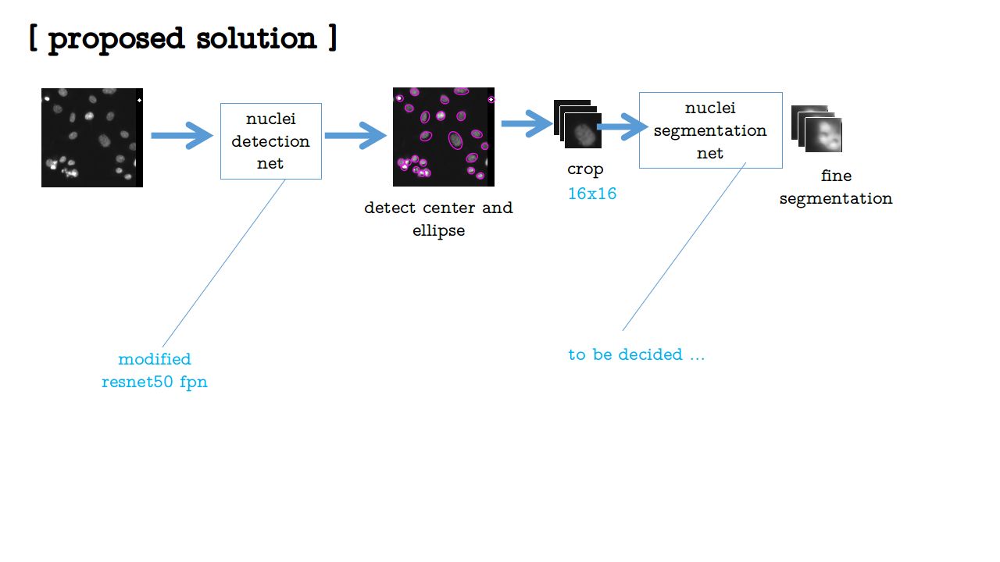

# Automate nucleus detection
2018 data science bowl

## Background
By automating nucleus detection, can help unlock faster-from rare discorders to the common cold.

## Nuclei
Identifing the cell's nuclei is the starting for most analyses. Identifying nuclei allows reasearchers to identify each individual cell in a sample, and by measuring how cells react to various treatments, the researcher can unferstand the underlying biological processes at work.

# Key Words
1. [RLF: Run-Length Enconding](https://zh.wikipedia.org/wiki/%E6%B8%B8%E7%A8%8B%E7%BC%96%E7%A0%81)
2. [U-NET: Convolution Networks for Biomedical Image Segmentation](https://arxiv.org/abs/1505.04597)
3. [mask R-CNN](https://arxiv.org/pdf/1703.06870.pdf) extends fast-RCNN *
4. [Watershed Transform](https://www.mathworks.com/company/newsletters/articles/the-watershed-transform-strategies-for-image-segmentation.html)

# Solution
## U-Net
[end-to-end training with U-Net](https://www.kaggle.com/fabsta/nuclei-segmentation-tensorflow-u-net-0-327-027909/notebook)
 (本质是像素点0-1二元问题的分类模型，没有解决多细胞连接的分割困难，这也是得分不高的主要原因) 
### pipeline
1. mask
 第一步，使用U-Net模型将所有像素进行分类，其输入是rgb三通道的灰度图片，输出是同尺寸的二值矩阵。其中1表示属于细胞，0表示否。 
2. label
 第二步，分割各个连通域，分别标记为1，2，3，...。 
3. encode
 最后，将图片转化为游长编码。
#### U-Net

* 输入：rgb三通道灰度图
* 输出：同尺寸二值矩阵

首先需要解决的是训练和测试样本的尺寸不一致的问题，这里有两种办法：
* 第一种，将所有图片放缩到同一大小，训练结束后再将预测结果等比例放大，这是最容易想到和实现的方法。
* 第二种，对图片进行填充和裁剪，这种方法巧妙在于图片不会失真，代价是图片变大后训练时间会明显增加。

第二种方法得到的结果确实更好一些。 
然后是对结果进行分割，如果只是使用传统的连通域分割方法，无法解决多目标连接的问题，得分在0.27左右。
使用腐蚀算进行优化，分数提高到0.34左右。

## mask R-CNN
[mask R-CNN](https://drive.google.com/drive/folders/1EtBdlPK3BVahHBZtB103QQxNUdWaJ6di)

*TO BE CONTINUE...*